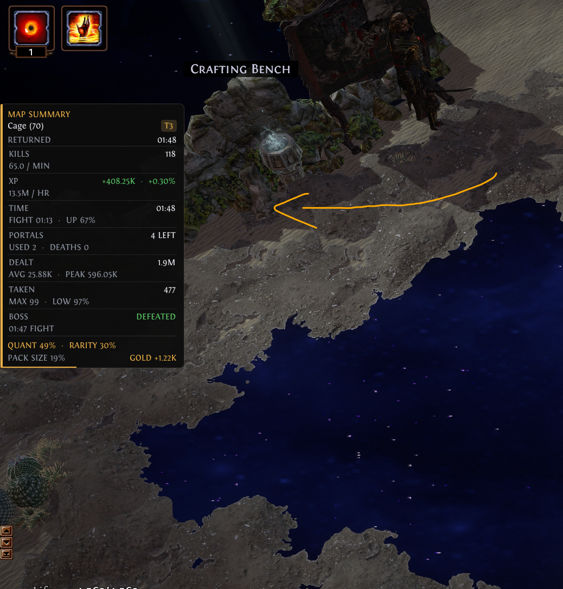
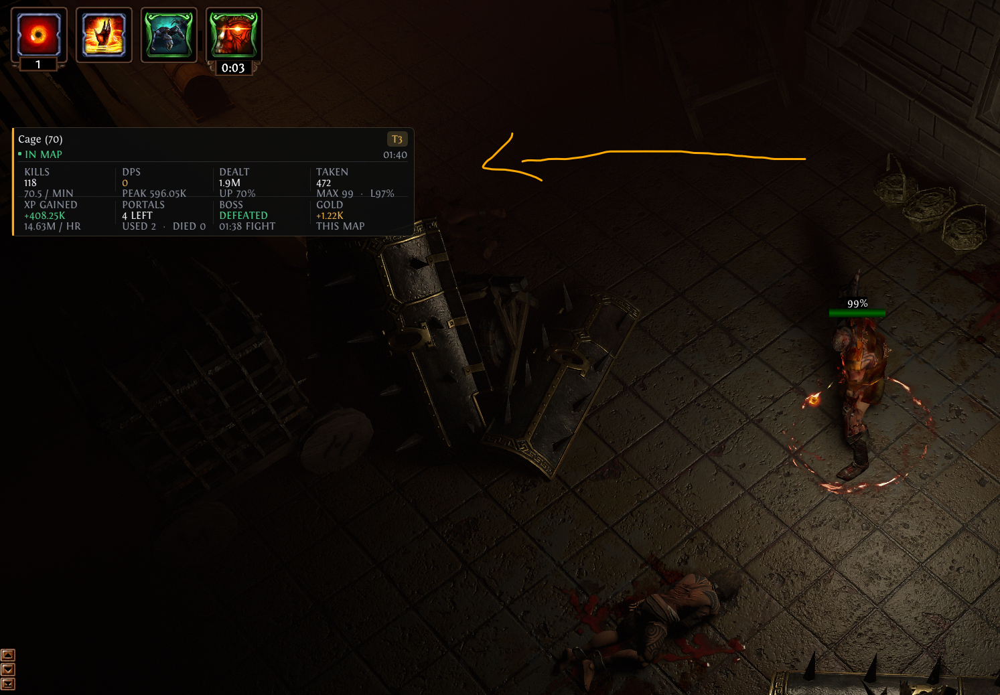

# MapLens V5.3

MapLens is a simple map-run tracker for ExileAPI.

It tracks useful information such as kills, map time, DPS, damage, XP, portals,
deaths, boss status, and gold.

V5.3 makes the hideout summary shorter and easier to scan, and replaces Burst
with combat uptime on the compact HUD. It also includes the V5.2 damage and map
rarity fixes and the V5.1 boss-arena fix.

## Installation

1. Download and extract `MapLens_V5.3_Release.zip`.
2. Place the `MapLens` folder inside ExileAPI's `Plugins\Source` folder.
3. Start ExileAPI and enable **MapLens** in the F12 menu.

## Display modes

- **Hideout Summary Only** — shows a vertical summary after returning to hideout.
- **Compact HUD Only** — shows a small panel while mapping.
- **Compact HUD + Hideout Summary** — enables both panels.

Hideout Summary Only is the default.

## Hideout summary

After returning from a map, MapLens shows a clean vertical summary on the left.

## In-map HUD

The optional compact HUD shows your current run information while mapping.

## Notes

- DPS and damage are estimates based on visible monsters losing health.
- UP is the percentage of map time spent in active combat.
- Run history resets when ExileAPI closes.
- Position, size, colors, displayed stats, and summary duration can be changed
  in the settings.

Made by Woogo. Pls message on Discord for problems or suggestions <3
